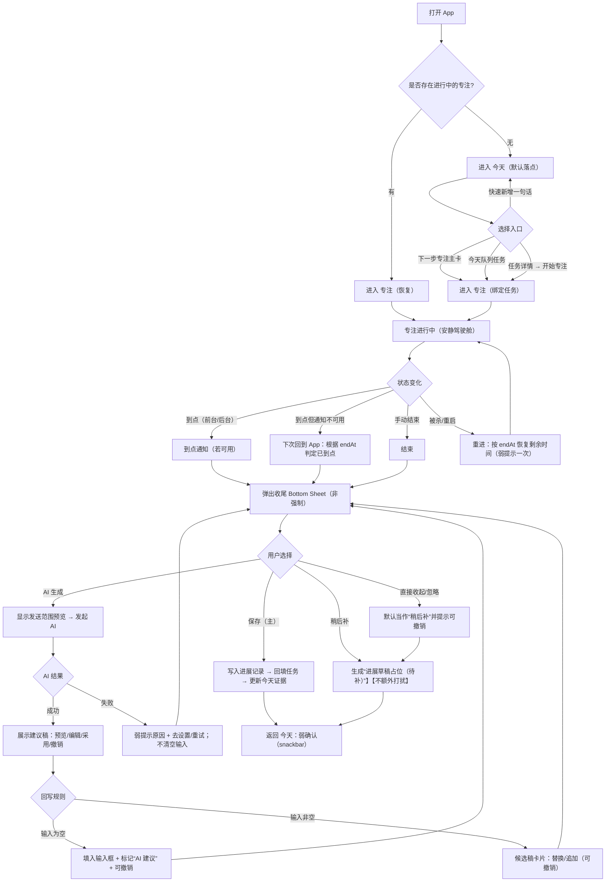
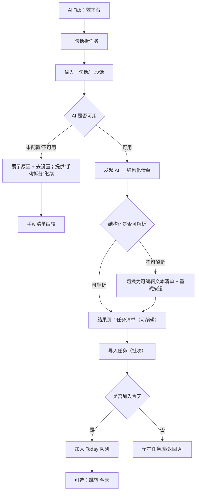
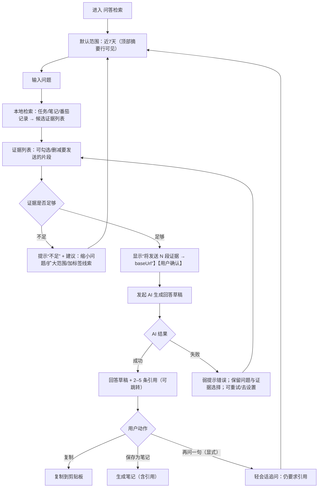
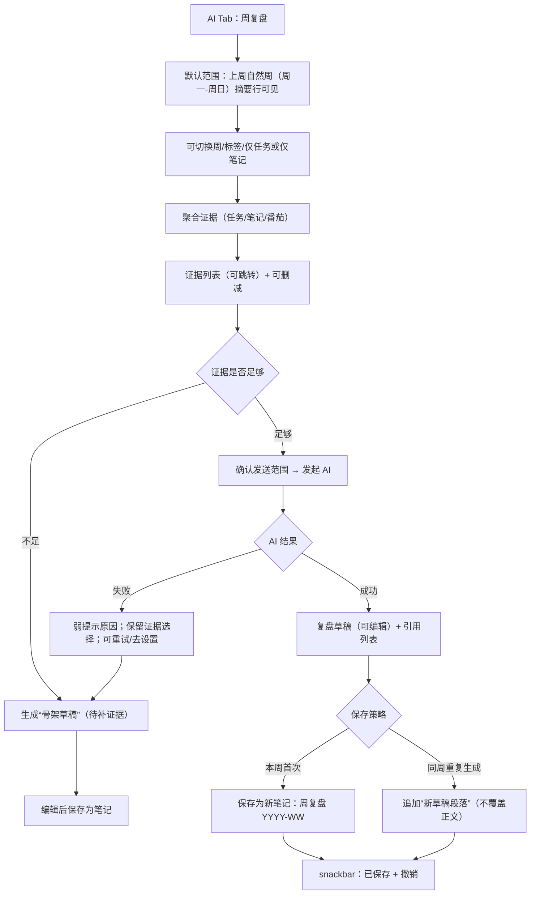
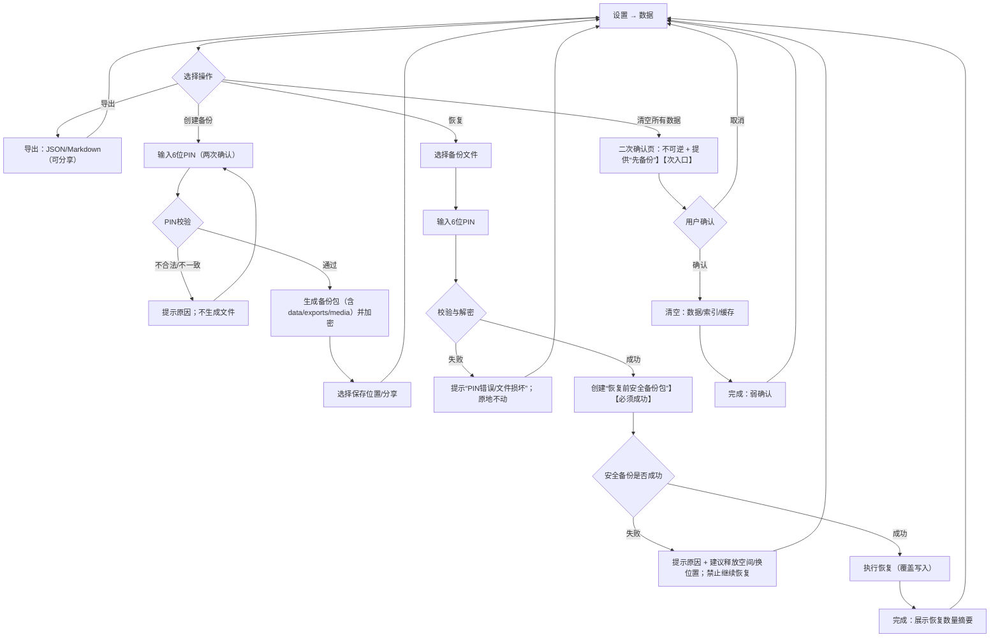

# UX 设计规范：pace-pilot

**Author:** User  
**Date:** 2026-01-12

---

<!-- UX design content will be appended sequentially through collaborative workflow steps -->

## Executive Summary

### Project Vision

pace-pilot 的愿景是：做一款 **无登录、本地优先、离线可用** 的个人工作节奏 App，把「任务 → 专注 → 进展记录 → 复盘」打成一条低摩擦闭环，让 AI 成为“把事情变清楚、把产出留住”的贴身助手，而不是打扰你的噪音源。

体验北极星（你打开它时应当感受到）：
- **好看**：克制、清爽、有留白；信息密度高但不拥挤；让人愿意长期使用
- **好用**：3 秒进任务、1 次点击开专注、结束后 10 秒写完（或 AI 生成）本番茄进展
- **可控可信**：AI 只在你明确触发时工作；清晰告诉你“会把什么发到哪里”；结果可编辑可撤销
- **可靠**：计时与通知稳定；被杀/重启后能恢复；离线也能继续记录与复盘

### Target Users

核心用户画像（单人使用、无账号）：
- **忙碌的知识工作者**（产品/研发/运营等）：任务多、上下文切换频繁，需要“快速变清晰 + 立刻进入执行”
- **深度专注型执行者**（开发者/创作者）：对番茄可靠性极敏感，希望专注时“安静、不中断、到点一定提醒”
- **隐私敏感用户**：不愿登录、不愿把工作内容交给云端；愿意 BYO Key，但要求透明与可控（发送范围/备份/清空）

主要设备与场景：
- Android 手机为主（通勤/碎片时间整理、工作时段专注、下班前复盘）
- 典型场景是“快速捕捉 → 快速组织 → 快速开干 → 自动留痕/复盘”

### Key Design Challenges

- **第一天就能用，但不被设置劝退**：无登录 + 本地优先的信任建立（数据在哪、怎么备份、怎么清空）；AI 配置（baseUrl/model/apiKey）必须“可选但不挡路”，建议渐进式开启
- **番茄的可靠性与“安静感”**：后台提醒必须准；状态恢复必须稳；专注时 UI 不要花哨、不要频繁弹窗打断心流
- **AI 失败兜底要像“好助理”**：401/429/无网/超时/无 Key 等失败，用“可读解释 + 下一步操作”而不是冷冰冰错误；AI 默认给建议，用户一键确认/编辑
- **控制权与可逆性**：AI 生成的任务拆分/今日计划/总结，都需要预览、编辑、撤销与明确的“采用”动作（避免强改用户原文导致不信任）
- **信息架构不分裂心智**：多 Tab（任务/专注/笔记/复盘/设置）容易割裂闭环，需要把关键路径做成“无脑可走”的最短路（任务详情 → 开专注 → 结束总结 → 自动回填 → 复盘可见）
- **好看不是装饰，而是秩序**：在高信息密度（筛选/标签/统计/记录）下保持层级清晰；用一致的排版、间距、颜色系统，让用户“看一眼就懂、点一下就到”

### Design Opportunities

- **把“闭环”做到极致顺滑**：一句话 → 任务清单（可编辑）→ 一键导入；任务页/详情页一键开专注；结束后“一句话进展”成为未来复盘素材
- **用“透明与可控”建立 AI 信任**：明确引用来源、明确发送内容与目标 baseUrl；提供“仅本地处理/仅结构化建议”等控制策略（不让 AI 夺权）
- **把复盘做成可回顾的工作故事**：以时间轴/卡片把“今日番茄产出、关键进展、明日建议”组织成可导出的工作日志（用户感觉“我一天真的做成了什么”）
- **视觉语言占领心智：宁静效率（Calm Productivity）**：低噪界面、柔和但有力量的主色、清晰的状态反馈与微动效（点到为止），让用户一打开就进入“要做事”的状态

## Core User Experience

### Defining Experience

pace-pilot 的核心体验是一条“安静但有力量”的工作闭环：**今天要做什么（清楚）→ 现在做什么（专注）→ 做成了什么（留痕）→ 以后能回看（复盘）**。  
你每次打开它，像打开一张秩序感很强的工作台：不用思考“从哪开始”，只需要选择“接下来做哪一个”。

最常发生、必须做到极致顺滑的动作是：
- **快速新增任务（One-line capture）**：一句话先收下，不打断；需要时再用 AI 变清晰
- **一键开始专注**：从今天计划或任务详情一键进入番茄；专注过程中安静可靠
- **番茄结束 10 秒收尾**：一句话进展（或 AI 生成）→ 回填任务，沉淀为复盘素材

### Platform Strategy

- **平台定位**：Android First、Touch First、单手可用；Local-first / Offline-first；无登录（信任来自“数据在本地 + 可导出/备份/清空”）。
- **导航结构（最终定稿）**：
  - 底部 5 Tab：`AI / 笔记 / 今天 / 任务 / 专注`
  - `今天`：位于中间且**视觉稍大**（克制强调，不花哨），明确“这是本 App 的核心能力舞台”
  - `设置`：右上角全局入口（AI 配置/番茄配置/数据掌控），不占 Tab，降低底部噪音
  - 视觉实现建议：优先用标准底部导航（Material 3 风格；Flutter Material 3），仅对“今天”做轻量权重提升（字重/选中态/胶囊），避免夸张凸起按钮
- **默认落点与恢复规则（写死）**：
  - 默认落点永远进入 `今天`（即使 `AI` 在左一）
  - 首次启动仅一次轻提示：`今天 = 工作台（昨天回顾 + 今天计划）`
  - 若番茄进行中：优先回到 `专注`（清晰展示当前任务与剩余时间），并提供“一键回到今天”
- **AI 使用与信任**：
  - AI 默认不自动跑；必须由用户明确触发
  - 每次调用都明确说明“将发送什么到哪里（baseUrl）”
  - 结果必须可预览、可编辑、可采用、可撤销；问答/复盘必须可追溯来源

### Effortless Interactions

- **今天页必须“一屏可读 + 两步可执行”**（不堆功能，堆秩序）：
  - 置顶：`快速新增`（一句话输入）
  - 核心区：`今天计划（今日队列）`（可执行队列，每项都能“一键开始专注”，支持拖拽排序）
  - 证据区：`昨天回顾`（默认折叠成卡片：完成/番茄/关键产出；点开看详情与导出）
  - 轻入口：`AI 辅助`（在今天页以轻量动作出现：拆任务/生成今天计划/总结昨天，不必跳 Tab）
- **今天 vs 任务：边界清晰（避免重复与迷路）**：
  - `任务` = 任务库/Backlog（长期沉淀、筛选、标签、批量）
  - `今天计划` = 今日队列（今天就要推进的少数事情）
  - 任务库任务支持一键 `加入今天`；今天队列支持排序与移出
- **今天页空态规则（不吵但不让人卡住）**：
  - 空态 A：没有任何任务 → 引导 `快速新增` / `一句话拆任务`
  - 空态 B：任务库有任务但今天队列为空 → 引导 `从任务加入今天`（可给 3 条建议项）
  - 空态 C：AI 不可用（无 Key/无网/限流）→ 不阻塞新增/专注；仅在触发 AI 时给清晰提示与“去设置/稍后重试”
- **专注页要像“安静的仪表盘”**：
  - 计时信息清楚且稳定；专注时不做多余打扰
  - 结束即出现轻量总结卡片：用户一句话即可；或点“AI 自动总结进展 + 下一步”→ 预览→ 保存→ 自动回填
- **AI Tab = 效率台（不是聊天入口）**：
  - 首页以三大主动作呈现（不以空白聊天框为主 UI）：
    1) `一句话拆任务`：输出可编辑清单 → 一键导入（可加入今天计划）
    2) `问答检索`：回答必须带引用来源与跳转（任务/笔记/番茄记录片段）
    3) `周复盘`：复盘草稿 + 证据列表 → 一键保存为复盘/笔记（可导出）
  - 提供“最近使用/最近结果”，让效率台越用越快
- **笔记页是“材料与输出”**：
  - 轻量记录、可关联任务
  - AI 动作以“建议 + 预览 + 采用”呈现（总结要点/提取行动项/改写同步版），不夺权

### Critical Success Moments

- **首日成功时刻（3 秒 + 3 次点击）**：开屏（今天页）看到昨天回顾与今天计划 → 一句话新增任务 → 一键开专注 → 番茄结束自动留下进展，用户立刻感到“我今天的工作被整理和留住了”。
- **绝对不能失败的时刻**：
  - 计时与通知不准、后台被杀后无法恢复（直接摧毁信任）
  - AI 输出不可控（强改原文/无引用胡说/无法撤销）导致“不敢用”
  - 无登录却数据不透明或不可导出，违背产品底层承诺

### Experience Principles

- **Calm Productivity（安静的效率）**：不花哨、不打扰；用层级、留白与一致性带来“商务稳重”的秩序感。
- **Today is the Home**：`今天`是默认落点与视觉中心，价值 3 秒可见。
- **One-line First**：先捕捉再变清晰；任何高频输入都允许“一句话完成”。
- **AI by Invitation**：AI 只在你点的时候工作；每次都可预览、可编辑、可采用、可撤销。
- **Evidence & Traceability**：问答与复盘必须给来源与跳转；用证据建立长期信任。
- **Reliability is UX**：计时、通知、状态恢复优先级高于一切动效与花哨功能。
- **Closed-loop by Default**：今天计划 ↔ 任务 ↔ 专注 ↔ 进展记录 ↔ 回顾天然串起来，用户不需要自己搬运整理。

## Desired Emotional Response

### Primary Emotional Goals

- **掌控感（Primary）**：用户随时知道“我在哪、我现在在做什么、下一步是什么”，并且关键结果可回退。
- **清晰感（Secondary）**：默认只展示“足够做决定的信息”，信息层级干净、动作入口明确。
- **专业可信（Secondary）**：整体气质稳重克制、说人话、可解释；AI 行为透明可追溯，避免夸张承诺与花哨干扰。
- **推进感（辅助目标）**：开屏像被拉回正轨——看见成果与计划，马上能开干（有劲但不躁）。

### Emotional Journey Mapping

- **初次打开（今天页：昨天回顾 + 今天计划）**：应感到“有活力 + 掌控”——一眼看到昨天的成果与今天的队列，并能立刻开始专注。
- **整理/规划（AI/笔记/任务）**：应感到“被支持但不被夺权”——AI 帮你变清晰，但最终决定权在你手上。
- **专注进行中（专注页）**：应感到“安静、沉浸、心流被保护”——稳定、少打扰、少选择。
- **番茄结束（总结/回填）**：应感到“成就感强且被记录”——10 秒收尾就把产出落回任务，未来可回看。
- **失败/异常（无网/无 Key/限流/超时）**：应感到“仍然可掌控”——不阻塞主闭环；解释清楚并给下一步，而不是制造焦虑。
- **再次回归使用**：应感到“专业稳定、值得信赖”——状态一致、记录可追溯、节奏可持续。

### Micro-Emotions

- **信任 vs 怀疑**：靠“引用、追溯、可撤销”建立长期信任。
- **自信 vs 困惑**：靠“下一步明确 + 入口一致”减少思考成本。
- **干劲 vs 焦虑**：靠“成果可见 + 队列清楚”提供推进感，靠“折叠与留白”避免过载。
- **沉浸 vs 被打扰**：靠“专注期安静模式 + 打断分级”保护心流。
- **成就 vs 挫败**：靠“结束即留痕 + 可累计回看”把成就感固化。
- **掌控 vs 失控（关键）**：任何“自动改写、不可撤销、状态丢失、提醒不准、边界混乱”都会触发失控感，必须系统性避免。

### Design Implications

- **把情绪词翻译成可验收定义**
  - “掌控”= 状态可见 + 结果可回退 + 关键路径不被卡住
  - “清晰”= 一屏可读 + 渐进展开 + 下一步入口一致
  - “专业”= 克制视觉 + 中性短句 + 可解释可追溯
  - “活力/推进感”= 成果可见 + 队列清楚 + 立刻能开干（不是靠强动效/强刺激）
  - “不被打扰”= 专注期只保留必要提醒；AI 不反客为主

- **AI 透明与信任（避免“不信任/失控”）**
  - AI 默认不自动跑；必须由用户明确触发
  - 每次 AI 动作都有固定“发送范围提示/发送预览”（默认简短，可展开展示 baseUrl 与内容范围）
  - 输出必须“预览/编辑/采用”，采用后提供“撤销”（至少一次可回退）
  - 问答/复盘必须给引用与跳转；引用不足时明确提示“证据不足”，不编造
  - 禁止强改原文：AI 以“建议”呈现，用户确认后才落地

- **打断与通知策略（避免“被打扰”，强化“专注感强”）**
  - 打断分级：
    - 仅允许“强打断”（对话框/全屏）出现在：番茄结束必须收尾、清空数据等不可逆确认
    - 其它一律用“弱打断”（底部提示条/顶部横幅/静默状态提示），并支持稍后处理
  - 专注期进入“安静模式”：
    - 专注进行中：不主动推 AI 建议、不弹与番茄无关的提示；AI 失败不弹窗
    - 若用户在专注期主动触发 AI：允许反馈，但优先弱打断 + 可重试，不迫使用户处理中断

- **清晰的信息秩序（强化“清晰感”）**
  - 今天页默认“一屏可读”：队列与 CTA 优先；昨日回顾默认折叠
  - 今天计划（今日队列）与任务库（Backlog）边界清楚：加入今天/移出/排序操作直观一致
  - 错误与提示遵循统一结构：`结论一句话` + `人话原因` + `下一步按钮` +（可选）`技术详情`

- **成功反馈策略（表达“推进感/成就感”但保持稳重）**
  - 成功反馈以“短促、克制、可忽略”的方式出现（优先弱打断），用于确认状态变化：已加入今天/已开始专注/已保存进展/已导出
  - 成就感来自“可累计证据”，而不是庆祝式动效：今日番茄、今日完成、今日关键产出、周复盘证据列表
  - 禁止持续闪烁/夸张庆祝/强刺激动效；避免破坏专业稳重与专注心流

- **兜底不阻塞（维持“掌控感”）**
  - 无 Key/无网/限流/超时：不阻塞新增任务、加入今天、开始专注、手写总结回填
  - AI 仅在被触发时提示问题，并给固定动作：`去设置 / 重试 / 稍后`

- **状态一致性与恢复反馈（强化“可靠=信任”）**
  - 番茄进行中恢复：必须出现一次弱打断确认（例如“已恢复专注：剩余 12:34”），避免用户怀疑计时是否可靠
  - 恢复后的下一步清晰：继续/暂停/放弃/结束，与返回今天入口始终可见

- **微文案规范（专业可信的语言系统）**
  - AI 透明提示模板：`将发送：{内容范围}` → `到：{baseUrl}` → `结果：可预览/可编辑/可撤销`
  - 错误提示模板：`发生了什么（一句话结论）` + `为什么（人话原因）` + `怎么做（下一步按钮）` +（可选）`技术详情`
  - 关键示例（写法示意）：
    - 无 Key：`未配置 AI` / `需要在设置中填写 baseUrl、model、apiKey` / `去设置`
    - 无网：`网络不可用` / `仍可继续新增任务与专注` / `稍后重试`
    - 限流：`请求过于频繁` / `请稍后再试` / `重试`（可加倒计时）
    - 证据不足：`证据不足` / `我在你的任务/笔记中没有找到支持该结论的内容` / `缩小范围`
    - 发送预览：`将发送：任务标题+描述（可编辑）` / `到：{baseUrl}` / `继续`

### Emotional Design Principles

- **掌控先于智能**：宁可少一点自动，也要多一点可控、可逆、可解释。
- **清晰先于丰富**：信息结构永远为“下一步行动”服务。
- **专业但有劲**：稳重克制，但让用户一打开就进入推进状态。
- **不打扰的帮助**：AI 只在你需要时出现，并且结果能落地。
- **可靠性就是情绪底盘**：计时、通知、状态恢复稳定，才能长期信任与复用。
- **像好助理一样说人话**：解释清楚 + 给下一步，是所有提示与错误的第一目标。

## UX Pattern Analysis & Inspiration

### Inspiring Products Analysis

#### TickTick（滴答清单）：任务×日程×专注的“执行中枢”

- **它优雅解决的核心问题**：把“要做什么”和“今天怎么推进”变成一条短路径：看队列 → 选一项 → 开始做 → 留痕。
- **导航与信息层级**：入口清晰（待办/日程/专注/笔记），并且“今天/当下”始终可快速回到；密度高但分层明确。
- **高频交互**：快速新增、今日队列、拖拽排序、轻量统计、任务与专注绑定（结束形成记录）。
- **对 pace-pilot 的启发（可迁移）**：
  - `今天`必须像 TickTick 一样是“推进台”，默认把用户送到下一步行动，而不是功能海。
  - `队列（今天计划）`与`仓库（任务库）`要边界清晰，一键加入今天/移出/排序。

#### Obsidian：本地优先的“证据库”与可检索沉淀

- **它优雅解决的核心问题**：记录可长期保存、可检索、可串联；用户对数据所有权天然信任（Local-first）。
- **高频交互**：快速记录、Daily Note（沉淀容器）、强搜索、链接/回链（让材料可复用）。
- **对 pace-pilot 的启发（可迁移）**：
  - `笔记`应服务于“复盘与执行”的证据沉淀：任务/番茄/复盘可关联，可追溯可跳转。
  - 搜索是主体验：全局检索 + 证据引用（与 AI 问答强绑定）。

#### 飞书（个人版）：商务稳重的文档秩序与“妙记式落地”

- **它优雅解决的核心问题**：用模板与结构把零散材料变成可复用输出；“妙记”把记录变成要点与行动项。
- **视觉语言**：商务稳重、排版克制、层级清楚。
- **对 pace-pilot 的启发（可迁移）**：
  - 把“番茄结束总结 / 日复盘 / 周复盘”做成模板化输出（可编辑、可导出）。
  - AI 输出以“结果落地”为目标：要点 + 行动项 + 引用证据。

### Transferable UX Patterns

**Navigation Patterns**
- `今天`作为工作台：默认落点 + 视觉中心（稍大但克制），一屏可读，CTA 收敛（新增任务/开始专注）。
- “队列 vs 仓库”：`今天计划=今日队列`，`任务=任务库`（一键加入今天/移出/排序）。
- `AI`以“效率台”呈现：动作优先（拆任务/问答检索/周复盘），不以空白聊天框做首页。

**Interaction Patterns**
- Quick Add：一句话捕捉 → 后续再结构化；AI 是加速器而不是门槛。
- 结束即留痕：番茄结束必须形成一条可回看的记录（手写或 AI），并回填任务进展。
- 模板化产出：复盘/总结用固定结构（像妙记一样从材料→要点→行动项）。

**Visual Patterns**
- “商务稳重的秩序感”：留白、对齐、稳定排版层级；强调状态与证据，而不是装饰。
- 渐进展开：默认只给决策所需信息，其它折叠或二级查看。

**AI Patterns（差异化重点）**
- Action-first：效率台三件事清晰可落地。
- Evidence-first：问答/复盘必须引用与跳转；证据不足明确提示，不编造。
- Control-first：发送范围提示/预览、结果可编辑可采用可撤销；AI 不阻塞主闭环。

### Anti-Patterns to Avoid

- `今天`过载：工作台变信息垃圾场 → 直接触发“失控/焦虑”。
- `今天`与`任务`边界混乱：同一任务多处出现且不一致 → 用户不知道以哪为准。
- AI 首页是聊天框：看起来酷但难落地，稀释主闭环（今天→专注→留痕→复盘）。
- 过早引入完整日程/时间块：把产品带向“日历/项目管理”，范围膨胀且破坏轻量与安静。
- 过早引入“知识图谱/复杂链接”：学习成本高，偏离“工作节奏闭环”。
- 强刺激动效/噪音反馈：破坏专业稳重与专注心流。

### Design Inspiration Strategy

#### What to Adopt

- TickTick：今日队列节奏感、任务×专注闭环、快速新增。
- Obsidian：Local-first 信任、强搜索、日常沉淀容器（为复盘提供证据库）。
- 飞书：商务稳重排版秩序、模板化输出、妙记式“材料→要点→行动项”。

#### What to Adapt

- “日程/时间感”：只做轻量“时间感表达”，不做完整时间块/日历产品。
- “第二大脑”：只保留能服务复盘与执行的关联与搜索，避免复杂知识图谱心智负担。
- “妙记”：落到番茄总结/日复盘/周复盘模板，强调可编辑与引用证据。

#### Key Decisions (Comparative Analysis Matrix)

**决策 1：今天要不要做时间块/日程感？**
- 方案 A：仅今日队列（无时间轴）
- 方案 B：队列 + 轻量时间感（可选开始时间/建议时段/预计番茄；非日历网格）✅ 推荐
- 方案 C：完整时间块/日历视图（类似 TickTick 日程/时间轴）

评分维度（1-5，高更好）：`贴合核心闭环`、`学习成本低`、`实现成本低`、`不容易膨胀`、`商务稳重`、`对 AI 落地友好`
- A：闭环 4 / 学习 5 / 实现 5 / 不膨胀 5 / 稳重 4 / AI 3
- B：闭环 5 / 学习 4 / 实现 3 / 不膨胀 4 / 稳重 5 / AI 5  ✅
- C：闭环 3 / 学习 3 / 实现 1 / 不膨胀 1 / 稳重 3 / AI 3

结论：MVP 采用 **B**。让“今天”更像推进台：队列为主，时间感是可选提示（例如：上午/下午/晚间建议、开始时间可选、预计番茄），避免走成日历产品。

**决策 2：笔记形态（Obsidian 风格到什么程度）**
- 方案 A：纯文本/轻富文本（强调快速记录）✅ 推荐
- 方案 B：Markdown（带少量格式与#tag，默认不要求用户懂语法）✅ 推荐
- 方案 C：Obsidian 式深链接/回链/知识图谱（重度第二大脑）

评分维度（1-5，高更好）：`记录速度`、`可检索/可引用`、`学习成本低`、`实现成本低`、`服务复盘闭环`
- A：速度 5 / 检索引用 3 / 学习 5 / 实现 4 / 闭环 4
- B：速度 4 / 检索引用 4 / 学习 4 / 实现 3 / 闭环 5 ✅
- C：速度 3 / 检索引用 5 / 学习 2 / 实现 1 / 闭环 3

结论：MVP 采用 **A+B 的混合**：编辑体验尽量“像富文本一样顺滑”，底层允许 Markdown 子集与 #tag；链接先做“任务/番茄/复盘的显式关联”，暂不做知识图谱。

#### Persona Validation (User Persona Focus Group)

- 忙碌知识工作者：最在意“今天打开就知道干什么”，方案 B（轻时间感）能提升推进感但不增加负担；C 会把人拖进排期。
- 深度专注型：最在意“不被打扰 + 可靠”，今天页不应承载复杂排程；专注与留痕必须更短更稳。
- 隐私敏感：更偏好 Obsidian 的本地与可迁移，但不希望学习成本上升；A+B 混合更符合“专业工具”的长期信任。

#### Devil’s Advocate (Challenge from Critical Perspective)

- 如果今天引入时间块：将不可避免引入“拖拽排期/提醒/冲突”等需求，范围膨胀并稀释闭环 → MVP 坚持只做轻量时间感。
- 如果笔记做成知识图谱：学习与维护成本高，且容易偏离“节奏与复盘” → MVP 只做可检索与显式关联。
- 如果 AI 过度聪明：会伤害掌控与信任 → AI 必须 Action-first + Evidence-first + Control-first。

#### Final Strategy (Critique & Refine)

- pace-pilot 的灵感策略不是“抄功能”，而是“抄秩序”：
  - 向 TickTick 学“推进台”
  - 向 Obsidian 学“证据库”
  - 向飞书学“专业表达与模板落地”
- 任何设计决策都必须服务主闭环：`今天 → 专注 → 留痕 → 复盘`，AI 是加速器而不是主角。

## Design System Foundation

### 1.1 Design System Choice

选择：**Material Design 3（Flutter Material 3）作为组件骨架 + PacePilot Tokens（ThemeExtension / 语义设计令牌）作为“气质控制台” + 少量封装组件（PacePilot UI Kit Widgets）**
- 原则：80% 复用 Flutter Material 3 成熟组件；20% 关键体验（`今天`工作台、`专注`仪表盘、`AI 效率台`）用“轻定制但可复用”的 UI Kit 实现。
- 关键约束：**只改 tokens，不散改组件**；差异化只允许进入 UI Kit（防止越做越乱）。

### Rationale for Selection

**对比矩阵（1-5 分，越高越好）**
- 方案 A：纯自研 Design System（最高独特性）
- 方案 B：Flutter Material 3 + Tokens + UI Kit（推荐）
- 方案 C：完全跟随 Material 3 默认样式（最快但偏“路人感”）

| 维度 | A 自研 | B 推荐 | C 默认 |
| --- | --- | --- | --- |
| MVP 速度 | 1 | 5 | 5 |
| 视觉“商务稳重”可控 | 4 | 5 | 2 |
| 一致性/可维护性 | 2 | 5 | 4 |
| 无障碍/状态规范 | 2 | 5 | 5 |
| 不易“越改越乱” | 2 | 5 | 3 |

结论：选择 **B**，在“速度 + 专业可信 + 气质可控”上最均衡，适合 pace-pilot 的单人/小团队迭代。

### Implementation Approach

#### ADR（Decision Record，写死不摇摆）
- 决策：采用 **Flutter Material 3 + ThemeExtension Tokens + 小而硬 UI Kit**
- 目的：稳定呈现“安静、商务稳重、掌控感”，并确保长期维护不碎裂
- 代价：需要前置定义 tokens 与少量封装组件；但能换来一致性与迭代速度

#### Tokens 体系（MVP v0.1：最小够用）
> 只定义“语义 tokens”，不定义“颜色/字号散点”。所有页面样式必须从 Theme/Tokens 获取。

**1) Color（语义色）**
- `surface/bg`：背景与卡片底（对齐 Material 的 `ColorScheme.surface` 系列）
- `textPrimary / textSecondary / textTertiary`：主/次/辅助文本
- `divider / outlineSubtle`：分割线与弱边框
- `accent`：行动锚点（用于主要 CTA、当前专注状态、关键数值强调；低饱和）
- `success / warn / error`：语义状态色（克制不刺眼）
- `focusRing`：可选（键盘/无障碍焦点提示）

**2) Typography（语义字阶）**
- `title`：页面/区块标题（稳重、清晰层级）
- `body`：正文（可读性优先）
- `caption`：注释/辅助信息（弱化但不灰到看不见）
- `label`：按钮/标签
- `timerDisplay`：专注计时大数字（专用样式，保证数字“稳、清、不过度炫”）

**3) Spacing（统一间距刻度）**
- `xs/s/m/l/xl`（例如 4/8/12/16/24）——只允许用刻度，不允许 `EdgeInsets(14)` 这种自由发挥

**4) Radius（统一圆角刻度）**
- `s/m/l`（列表、卡片、弹窗统一节奏）

**5) Motion（不打扰动效）**
- `fast/normal/slow` + 统一 easing（只用于状态反馈，不做庆祝动效）

#### 工程护栏（Failure Mode → 防失控措施）
- 禁止硬编码：`Color / TextStyle / EdgeInsets / Radius / Duration` 出现在业务页面（UI Kit 内部允许，但也应尽量走 tokens）。
- 禁止局部 Theme “偷改”：页面内随意 `Theme(data: ...)` 会造成漂移；如确需局部差异，只能通过 UI Kit 组件参数化。
- 深色模式底线：文本对比度必须可读；`textSecondary` 不能灰到“商务=看不清”。
- 专注期降噪：专注进行中不弹多余提示；反馈以弱打断为主（banner/snackbar），避免对话框打断心流。

#### UI Kit（MVP v0.1：只封装 3–5 个“差异化且高复用”组件）
> UI Kit 的目标不是造第二套组件库，而是把“差异化规则”关进笼子。

**必做（3 个）**
1) `PaceBottomNavBar`：底部 5 Tab 的唯一实现（`AI / 笔记 / 今天 / 任务 / 专注`）
   - **“今天轻强化”唯一规则**：固定组合（例如“选中态胶囊 + 字重提升”）；禁止发光/浮起/多重描边
2) `PaceActionCard`：AI 效率台三大动作卡片（拆任务/问答检索/周复盘）
3) `PaceFocusTimer`（或 `PaceTimerDisplay`）：专注页计时与状态展示（仪表盘式安静呈现）

**可选（最多再加 2 个）**
4) `PaceResultSheet`：AI 结果统一承载容器（预览→编辑→采用/撤销）
5) `PaceInlineNotice`：弱打断提示（成功/失败/无网/无 key 等，统一样式与信息结构）

#### 分层说明（Expand/Contract）
- **给设计（你调什么）**：只调 `Tokens`（色彩语义、字阶、间距/圆角、动效节奏），不在页面里做“单点美化”。
- **给研发（你怎么做）**：所有页面使用 Material 3 + UI Kit；所有视觉参数从 `ThemeData + ThemeExtension Tokens` 取；差异化只能进入 UI Kit。

### Customization Strategy

- **Calm Business 色彩策略**：中性底色 + 低饱和 accent；语义色克制，避免“刺眼=不专业”。
- **层级策略**：用字重与留白制造秩序感；信息密度高但不拥挤。
- **一致性策略**：同类信息同样式；同类动作同位置；同类反馈同结构（结论一句话 + 人话原因 + 下一步按钮）。
- **“看起来像系统默认”的风险对策**：不靠炫色块，而靠排版/间距/一致性建立“高级与可信”。

## Defining Interaction（核心体验定义）

### Defining Experience（定义动作，一句话）

pace-pilot 的定义动作是一个 **3-2-10 闭环**：  
**3 秒看清下一步（今天工作台） → 2 步开干（一键开始专注） → 10 秒留痕（进展+下一步回填任务；AI 可加速但不夺权）**。

用户对朋友的描述应该是：  
“我每天打开它就知道该做什么，点一下就开始专注；结束时 10 秒把成果留住，之后复盘也能直接看到证据。”

> 第一性原理：用户最稀缺的是注意力与信任。我们用“安静的秩序”减少思考与切换，用“证据可追溯 + 结果可撤销”建立长期可信。

### User Mental Model（用户心智模型）

用户心里有一张很朴素的地图：

- `今天` = 我今天要推进的少数关键事情（队列/工作台）
- `任务` = 长期 Backlog（筛选/标签/批量/沉淀）
- `专注` = 安静驾驶舱（只做计时与必要反馈）
- `AI` = 效率台（动作优先：拆任务/问答检索/周复盘；不是聊天入口）
- `设置` = 右上角（不占 Tab 噪音；AI 配置可选但不挡路）

用户现状常见是“工具碎片化”：任务在 TickTick、笔记在 Obsidian、协作在飞书、AI 在聊天工具里；切换带来**被打扰与失控**。  
pace-pilot 的承诺不是“替代所有工具”，而是提供一个**安静的工作台**把“推进与留痕”串成闭环。

**用户画像快速验证（焦点小组结论）：**
- 忙碌知识工作者：最在意“打开就能推进”，反感被设置/AI 劝退 → `今天`默认落点 + AI 仅在明确触发时出现
- 深度专注型：最在意“不中断 + 到点一定提醒 + 状态可恢复” → `专注`驾驶舱最少选择，反馈分级
- 隐私敏感：最在意“数据在本地 + 可导出 + AI 发送透明可控” → 发送预览/可撤销/引用证据

### Success Criteria（成功标准：可验收）

**速度与可执行**
- `今天`默认落点，一屏可读；用户 3 秒内能做出“下一步做什么”的决定。
- 今天队列任一项都能 **2 步内开专注**（Today → Start）。
- 番茄结束 **10 秒内完成收尾**：一句话即可保存；AI 只是加速器。

**可靠与安静**
- 专注期不做无关打扰：非必要不弹窗；以弱打断反馈为主（banner/snackbar）。
- 计时与通知可靠；被杀/重启后能恢复，并给一次弱提示确认“已恢复剩余时间”。

**AI 的可信与可控**
- AI 永不阻塞主闭环：无 key/无网/限流/超时 → 仍可新增任务、开始专注、手写总结回填。
- 所有 AI 输出统一走 **预览 → 编辑 → 采用/撤销**（默认不自动落地）。
- AI 绝不覆盖用户输入：AI 输出以“建议稿”出现，用户点“采用”才写入。
- 问答/复盘必须带引用来源与跳转；证据不足明确提示“不足”，禁止编造。

**“10 秒留痕”必须不打断但不丢证据（关键护栏）**
- 番茄结束后若用户当下不方便填写：允许点 **“稍后补”**，但系统仍自动生成一条“进展草稿”（含任务/时间戳/番茄段信息），并在 `今天/任务详情`以安静标记呈现“待补进展”。
- 不做追命式打扰：不发额外通知、不弹强制对话框；只在用户下一次回到 Today 或进入任务详情时，用弱提示引导补齐。

### Novel UX Patterns（差异化但不陌生）

- Established：底部导航、任务列表、番茄计时、结束总结（用户无需学习）。
- Unique twist（差异化）：
  - **3-2-10 闭环**把“推进”与“留痕”绑定成习惯。
  - `AI` 做成“效率台三大动作”，而不是空白聊天框。
  - **Evidence & Traceability**：问答/复盘必须引用与跳转，强化长期信任。
  - **Today is the Home**：即使 `AI` 在左一，默认落点仍是 `今天`，强化掌控感。

### Experience Mechanics（体验机制：一步步怎么走）

**0) 开屏（永远的起点）**
- 打开 App → 默认进入 `今天`
- 结构：快速新增（置顶）→ 今天队列（核心）→ 昨天回顾（默认折叠）→ AI 轻入口（可选）

**1) 捕捉（One-line first）**
- 快速新增：一句话建任务（不强迫结构化）
- 需要更清晰时：跳转 `AI` → “一句话拆任务” → 生成可编辑清单 → 一键导入（可同时加入今天）

**2) 进入执行（2 步开干）**
- `今天队列`任一项 → 一键开始专注 → 进入 `专注`（任务名 + 剩余时间 + 极简控制）

**3) 专注进行中（安静驾驶舱）**
- 专注期默认静默：不推 AI、不弹无关提示
- 若中途返回：状态稳定可恢复；给一次弱提示“已恢复专注”

**4) 到点收尾（10 秒留痕：状态机与字段最小集）**
- 到点通知 → 回到 App → 出现“收尾 Bottom Sheet”（非强制对话框）
- Bottom Sheet 最小字段（默认只露 1 个输入）：
  - 主输入：`一句话进展`（自动聚焦；可选 2–3 个模板 chips：如“已完成…/遇到阻塞…/下一步是…”）
  - 次输入（折叠）：`下一步`（可选，展开才出现）
- 操作按钮（固定三件事）：
  - `保存`：写入进展记录 → 回填任务 → 更新统计
  - `稍后补`：生成“进展草稿（待补）”→ 不阻塞用户继续做事
  - `AI 自动生成`（可选）：显示发送范围与 baseUrl → 生成建议稿 → 预览/编辑 → 采用/撤销
- AI 不可用时：`AI 自动生成`置灰，并用弱提示说明原因 + “去设置/稍后重试”；但 `保存/稍后补`始终可用

**5) 回填与成就感（证据沉淀）**
- 保存或稍后补都会产生可追溯证据（正式记录或草稿占位）
- 弱反馈确认（不庆祝、不喧闹）：已保存/已回填/已生成待补草稿

**6) 周复盘（AI 真正提效的地方）**
- `AI` 效率台 → 周复盘草稿（带证据列表与跳转）→ 用户编辑 → 保存为复盘/笔记并可导出

## Visual Design Foundation（视觉基础 · Step 8）

### Visual Tone（视觉气质）

关键词：**安静、商务、稳重、清晰、可控**。  
目标不是“酷炫”，而是让用户打开即进入“掌控工作台”的状态：低噪界面 + 高秩序信息层级 + 克制但有力的状态反馈。

### Color System（颜色系统）

策略：**中性底盘固定 + 只切换 Accent**（避免越用越散，也避免主题切换带来不信任感）。

**A 主题（默认）：Slate Blue / Calm Graphite**

- Light
  - `bg`：`#F6F7F9`
  - `surface`：`#FFFFFF`
  - `textPrimary`：`#0B1220`
  - `textSecondary`：`#475569`
  - `divider/outline`：`#E6E8EE`
  - `accent`：`#2F5D9B`
  - `accentContainer`：`#DCE8F8`
- Dark
  - `bg`：`#0B0F14`
  - `surface`：`#111827`
  - `textPrimary`：`#E5E7EB`
  - `textSecondary`：`#A1A9B7`
  - `divider/outline`：`#253045`
  - `accent`：`#7AA6FF`
  - `accentContainer`：`#1C2A44`

**B 主题（可切换）：Deep Teal（仅切换 Accent）**
- `accent`：Light `#0F766E` / Dark `#44C2B3`
- `accentContainer`：Light `#D6F3EF` / Dark `#123B36`

**C 主题（可切换）：Olive Gray（仅切换 Accent）**
- `accent`：Light `#5B6B3A` / Dark `#B8C48A`
- `accentContainer`：Light `#E7EDD8` / Dark `#2B341C`

**使用硬规则（必须遵守）**
- **Accent 预算**：单屏只允许 1 个“主焦点”使用 `accent`（如主 CTA/当前进行的 Focus），其余强调用 `accentContainer`、字重、层级完成。
- **Today 轻强化唯一规则**：只允许 `accentContainer + 字重提升`（禁止发光、浮起、渐变描边、多重边框、跳动动效）。
- **层次优先 tonal surfaces**：优先用 `surfaceContainer*` / 分隔线做层次，尽量少阴影（商务稳重）。
- **语义色只做语义**：success/warn/error 仅用于状态与反馈，不做装饰色。
- **可访问性**：正文对比目标 WCAG AA（4.5:1；大字 3:1）；触控目标 ≥ 48dp；状态不能只靠颜色表达。

### Typography（排版）

字形策略：系统字体优先（可靠、商务），数字建议启用等宽/Tabular（Focus 计时更稳）。

建议字阶（MVP 基线）：
- `title`：20/28 W600（今日核心标题、任务详情标题）
- `body`：14/20 W400（正文、列表主要信息）
- `label`：13/16 W500（按钮、Chip、Tab 文案）
- `caption`：12/16（说明、次要元信息）
- `timerDisplay`：48–56 W600（专注页计时显示；建议 tabular numerals）

### Spacing & Shape（间距与圆角）

间距刻度（禁止自由数值）：`4 / 8 / 12 / 16 / 24`  
圆角刻度（建议）：`10 / 12 / 16`（Chip/卡片/Sheet 分级，保持统一）

### Motion（动效）

原则：**点到为止**（不制造噪音，不抢走专注）。
- 微交互：120ms（按压/选中/切换）
- 常规转场：200ms（列表/卡片展开）
- 大转场：280ms（页面 push/pop，如使用）

### Flutter Material 3 落地（实现约束）

- 统一入口：`ThemeData(useMaterial3: true) + ColorScheme + TextTheme + ThemeExtension(tokens)`
- 建议做法：用 `ColorScheme.fromSeed(seedColor: accent, brightness: ...)` 生成完整 scheme，再用中性底盘覆盖 `background/surface/onSurface/outline` 等关键位，保证一致与完整性。
- 主题切换：只允许切换 `accent/accentContainer`（A/B/C），中性底盘固定；深浅色跟随系统或设置项。
- 页面层禁止硬编码：`Color / TextStyle / EdgeInsets / Radius / Duration` 不允许直接写在业务页面；差异化必须进 UI Kit/Token。

## Design Direction Decision（设计方向决策 · Step 9）

### Design Directions Explored（已探索方向）

我们在 `_bmad-output/planning-artifacts/ux-design-directions.html` 中对比了 6 个方向（统一遵守 Step 8 的颜色/排版/动效约束）：

1. **方向 1：工作台卡片（Calm Workbench）**  
   模块分区清晰、留白克制，最贴合“安静 + 掌控”的主气质。
2. **方向 2：清单高密度（List-first / TickTick-like）**  
   学习成本低、信息密度高；风险是界面噪音上升、削弱“安静感”。
3. **方向 3：时间线叙事（Timeline Work Story）**  
   强调“我一天做成了什么”的故事线；风险是新手信息更丰富，需要约束展示量。
4. **方向 4：模块仪表板（Quiet Dashboard）**  
   更“商务台面”的模块化一屏；风险是容易滑向“报表墙”，稀释核心闭环。
5. **方向 5：专注优先（Focus-first）**  
   把“开干”做成第一驱动力；风险是任务库显得过于克制，长尾管理弱。
6. **方向 6：证据优先（Evidence-first / Trust-first）**  
   把“不信任”当核心对手：引用、可撤销、发送范围透明；风险是更严肃，但与目标情绪一致。

### Chosen Direction（最终选择）

**主线方向：方向 1（工作台卡片） × 方向 6（证据优先）**，并“收编”其它方向的局部能力，形成一套可执行的 MVP 组合：

- **D1 作为默认骨架**：Today 工作台卡片化承载“下一步 / 今天队列 / 昨天回顾 / AI 轻入口”，保持秩序与留白。
- **D6 作为信任底盘**：AI 的输出与检索必须“可追溯（引用）+ 可控（预览/编辑/采用/撤销）+ 透明（发送范围）”。
- **D5 收编到 Today 主卡**：Today 顶部允许存在且仅存在 1 张“下一步专注”主卡（唯一主焦点）。
- **D2 仅下沉到长列表**：只在 `任务库/笔记列表/检索结果`提供“舒适/紧凑”密度切换；`今天/专注`禁止密度开关。
- **D3 作为 MVP 唯一增强层**：在“昨天回顾/复盘”提供番茄段级时间线，但默认折叠、严格控量（见下文规则）。
- **D4 延后**：仅保留折叠摘要（非 KPI 报表墙），避免喧宾夺主。

### Design Rationale（为什么这样选）

- **情绪目标对齐**：用户追求“掌控/清晰/专业”，D1 提供秩序感，D6 提供可信感（证据与可逆）。
- **对抗负面情绪**：用户最大的敌人是“不信任/被打扰/失控”。我们用“弱打断、强兜底、可撤销”消除焦虑源。
- **服务 3-2-10 闭环**：  
  3 秒看清下一步（Today 一屏可读）→ 2 步开专注（Today/任务 → Start）→ 10 秒留痕（结束 Sheet 一句话即可保存）。
- **AI 定位明确**：AI 是效率台（动作优先），不是聊天噪音源；AI 只在你触发时工作，且永不阻塞主闭环。

### Implementation Approach（实现落地策略）

**导航与入口（硬规则）**
- 底部 5 Tab：`AI / 笔记 / 今天 / 任务 / 专注`；`今天`为默认落点且视觉稍大（强调核心能力）。
- `设置`：右上角全局入口（不占 Tab，避免噪音）；AI 配置可选但不挡路。
- `AI Tab = 效率台`：MVP 三大动作：`一句话拆任务 / 问答检索（带引用）/ 周复盘`；禁止把 AI 变成聊天首页。

**时间线控量（MVP 规则）**
- Today 的 `昨天回顾`默认折叠；展开态默认只显示最近 **6 条**番茄段（按时间倒序）。
- “查看全部昨日时间线”进入完整列表（按小时分组/可筛选/懒加载）。
- 点击时间线节点默认进入 `番茄段详情`；若节点为“待补”，进入详情后自动弹出“补写 Sheet 并聚焦”（同次进入不重复弹）。

**AI 不夺权（MVP 硬护栏）**
- `保存`永远是唯一主 CTA；`AI 自动生成`为次要入口，且 AI 失败不得阻塞保存/稍后补。
- AI 回写策略：
  - 输入为空：可直接填入并显示“AI 建议”标记 + `撤销`
  - 输入非空：禁止静默覆盖；以候选稿卡片呈现 `替换/追加`（必须可撤销）
- 任何失败（无网/超时/401/429）不得清空输入、不得重置光标位置。

**信任与透明（MVP 硬规则）**
- 问答检索默认范围：**近 7 天**；结果页顶部固定一行“检索范围摘要”。
- 任何回答必须带 **2–5 条可跳转引用**；证据不足必须明确提示“不足”，禁止编造。
- 发送范围必须可见：展示“将发送哪些片段 → baseUrl”，用户可删减后再发起。

**周复盘（MVP 规则）**
- 默认时间范围：上周自然周（周一–周日）。
- 输出形态：生成草稿 + 证据列表 → 用户编辑 → **保存为笔记**（默认每周新建一篇）。
- 同一周重复生成：写入同一篇作为“新草稿段落”，禁止覆盖已编辑正文。

**数据掌控（MVP 必做）**
- 三件套：`导出 / 备份 / 清空（含恢复）`，作为“无登录可控可信”的底层承诺。
- 备份包：ZIP（`data/*.json` 可恢复 + `exports/*.md` 可阅读迁移 + `media/` 附件）。
- 加密：备份 ZIP 加密；密码规则为 **恰好 6 位数字 PIN（允许 0 开头）**；PIN 不保存、不回填，不包含 apiKey。
- 恢复：恢复前自动生成“安全备份包”；校验通过才覆盖；失败必须“原地不动”不改现有数据；完成后展示恢复数量摘要。

**设置可发现性（不打扰）**
- 首次触发/失败时仅给“单行可关闭提示”，每类提示只出现一次；不做教学弹窗。

**MVP Non-goals（禁止做）**
- 不做 Today 主屏统计墙/报表墙；不把全量时间线铺在 Today。
- 不做 AI 自动跑、自动改写用户内容；AI 一律“预览/编辑/采用/撤销”。

## User Journey Flows（用户旅程流程 · Step 10）

### 旅程 1：3-2-10 核心闭环（Today → Focus → 10 秒留痕）

**目标**
- 3 秒看清下一步；2 步开专注；到点后 10 秒留痕（允许“稍后补”但不丢证据）。
- AI 永不阻塞：无网/无 key/超时/限流时仍可保存与继续推进。

**入口**
- App 打开（默认 Today，但若存在进行中的专注则进入 Focus）
- Today 顶部“下一步专注”主卡 / Today 队列任务 / 任务详情“开始专注”

**关键反馈**
- 专注期安静：不推 AI、不弹窗；仅必要状态（计时、暂停、结束）。
- 逃生门：专注页顶栏常驻 `返回今天`；Today 顶部常驻 `专注进行中` 安静条/卡（1 次点击回专注）。
- 结束收尾 Sheet：`保存`唯一主 CTA；`稍后补`次要；`AI 生成`为可选加速器。
- “稍后补”会生成进展草稿占位，并在 Today/任务详情以弱标记呈现（不追命打扰）。

#### 异常与兜底（验收级护栏）

| 失效/风险 | 触发 | 用户看到什么 | 系统必须做什么 |
|---|---|---|---|
| 通知权限未开/被系统禁用 | 初次进入专注或到点未提醒 | `专注提醒未开启` 单行提示（一次性，可关闭）+ `去开启` | 不阻塞专注；用 `endAt` 保底恢复；到点时下次回到 App 必须识别“已到点待收尾” |
| 专注进行中但用户回到 Today | 用户习惯“今天是家” | Today 顶部出现 `专注进行中` 安静条/卡（可一键回到专注） | 不弹窗、不打断；但必须可见且 1 次点击可回到专注 |
| 收尾 Sheet 被滑掉/关闭 | 误触或嫌麻烦 | snackbar：`已先保存为待补草稿` + `撤销` | 生成待补草稿占位；撤销需可恢复到“未生成草稿”的状态 |
| 数据写入失败（磁盘满/DB 锁） | 保存进展/导入任务/保存笔记 | 明确错误 + `稍后重试`；输入内容原地保留 | 绝不丢输入；失败不得回退页面导致内容消失 |
| AI 失败（401/429/超时/无网） | 任意 AI 动作 | 弱提示原因 + 下一步（去设置/重试/缩小范围） | 不清空输入、不重置光标；`保存/稍后补`始终可用 |

#### 发送范围（最小化默认发送）
- 番茄收尾 `AI 生成` 默认发送：`任务标题` +（可选）`任务描述` + `番茄段开始/结束/时长` + `用户本次输入（若有）`。
- 预览默认折叠为一行摘要（安静），但必须可展开查看完整内容并允许删减。

### 旅程 2：AI 效率台（一句话拆任务 → 导入 → 可选加入今天）

**目标**
- 把模糊需求变成可执行清单，且可编辑、可控、可撤销。

**入口**
- 底部 Tab `AI` → 卡片 `一句话拆任务`
- Today/任务页可提供轻入口，但主心智在 AI 效率台

#### 异常与兜底（验收点）

| 失效/风险 | 触发 | 用户看到什么 | 系统必须做什么 |
|---|---|---|---|
| AI 未配置/不可用 | 无 key / 无网 / 401/429 | 单行弱提示 + `去设置`；仍可“手动拆分” | 不阻塞；保留输入；可手动写清单再导入 |
| 结构化输出解析失败 | 返回非 JSON/字段缺失 | `结构化结果异常，已切换为可编辑文本` + `重试生成` | 展示可编辑文本清单；允许手动调整后导入 |
| 批量导入误导入/重复 | 用户后悔或误触导入 | snackbar：`已导入 X 条任务` + `撤销` | `撤销` 仅撤销本批次创建的任务；不得影响既有任务 |
| 部分导入失败 | DB 写入/校验失败 | `导入完成（X 成功 / Y 失败）` + `查看失败项` | 失败项保留为“待导入草稿”；支持一键重试 |
| 导入后想立即开干 | 追求最短路 | 导入成功页有 `加入今天` + `去今天` | 勾选后把选中任务加入 Today 队列；保证 2 步内开专注 |

### 旅程 3：问答检索（Evidence-first，带引用可跳转）

**目标**
- “回答可信”：默认显示检索范围；回答必须带引用；证据不足明确提示“不足”。

**入口**
- AI Tab：`问答检索（带引用）`
- 任务/笔记详情提供“在此范围问一句”（轻入口，非长对话）

#### 异常与兜底（验收点）

| 失效/风险 | 触发 | 用户看到什么 | 系统必须做什么 |
|---|---|---|---|
| 证据为 0 | 本地检索无结果 | `证据不足，无法回答` + 建议；可选 `扩大到30天` | 禁止“硬答”；提供可操作下一步 |
| 证据过多/过长 | 片段过长导致超限 | `证据过长，已自动选取最相关 N 段` + 可调整 | 默认 Top 5；发送前允许删减；范围摘要行必须可见 |
| 追问变聊天噪音 | 连续追问 | `再问一句` 显式按钮，不让长聊常驻 | 默认沿用上次证据选择但可改；每次仍需引用与跳转 |
| 证据不足但用户坚持要结论 | 高频真实需求 | `只能基于现有证据给出“不确定/可能性”`（明确标注） | 引用必须来自证据列表；否则只能输出“不足/不确定”与补证据路径 |

### 旅程 4：周复盘（上周自然周 → 草稿 → 保存为笔记）

**目标**
- 把一周沉淀成“可回看的工作日志”，不制造打扰；重复生成不覆盖用户编辑。

**入口**
- AI Tab：`周复盘`

#### 证据不足策略（硬规则）
- 若证据 < 2 条或分布过窄：生成**骨架草稿**而不是“写满的总结”：
  - `本周做成了什么（待补证据）`
  - `关键产出（待补证据）`
  - `阻塞/风险（可选）`
  - `下周三件事（可选）`
  - `可用证据列表（可跳转）`

#### 异常与兜底（验收点）

| 失效/风险 | 触发 | 用户看到什么 | 系统必须做什么 |
|---|---|---|---|
| 证据过长超限 | 选中片段太多/太长 | `已自动选取最相关 N 段` + 可调整 | 默认 Top 5；发送前允许删减帮助建立掌控感 |
| AI 失败 | 超时/401/429/无网 | 弱提示 + `重试/去设置` | 保留证据选择与骨架草稿；不阻塞“保存为笔记” |
| 同周重复生成覆盖风险 | 用户已编辑正文 | `将追加到本周复盘笔记（不覆盖正文）` | 只允许追加；追加后 snackbar 提供 `撤销` |
| 保存笔记失败 | DB/存储失败 | `保存失败，草稿已保留` + `重试` | 草稿原地保留；重试不丢内容 |

### 旅程 5：数据掌控（导出/备份/恢复/清空）

**目标**
- 无登录信任底座：可迁移、可恢复、可清空；高风险操作必须有安全网与清晰确认。

**入口**
- 右上角 `设置` → `数据`

#### 异常与兜底（验收点）

| 失效/风险 | 触发 | 用户看到什么 | 系统必须做什么 |
|---|---|---|---|
| PIN 输错/文件损坏 | 解密失败 | `PIN 错误或文件损坏` | 必须“原地不动”；不改任何现有数据 |
| 创建备份空间不足 | 写文件失败 | `空间不足，无法创建备份` | 不生成半成品；引导释放空间/选择位置 |
| 用户忘记 PIN | 长期风险 | 创建备份时一次性弱提示：`PIN 丢失将无法恢复`（可关闭） | 不保存 PIN；不做反复提示 |
| 清空误触 | 高风险操作 | 二次确认文案清晰 + `先备份` 次入口 | 清空后提示完成；不提供撤销（不可逆） |

#### 备份/加密规则（硬约束）
- 备份包：ZIP（`data/*.json` 可恢复 + `exports/*.md` 可阅读迁移 + `media/` 附件）。
- 加密：对备份包整体进行强加密（实现建议：加密容器 / AES-GCM，避免依赖 ZIP 密码实现细节），PIN 规则：**恰好 6 位数字（允许 0 开头）**；PIN 不保存、不回填；备份不包含 apiKey。
- 恢复前必须成功创建“恢复前安全备份包”，否则禁止继续恢复（避免失控不可逆）。

### Journey Patterns（跨旅程复用模式）

- **App 启动落点规则**：若存在进行中的专注 → 直接进入 `专注`；否则进入 `今天`（默认）；（可选 P1）“记住上次 Tab”默认关闭。
- **Preview → Edit → Adopt/Undo**：所有 AI 输出统一走预览与可逆，禁止静默覆盖用户输入。
- **Scope Summary Line**：问答/复盘页顶部固定显示检索范围摘要（默认近 7 天 / 上周自然周）。
- **Evidence-first**：回答/复盘必须给引用且可跳转；引用必须来自证据列表；证据不足明确“不足”，禁止编造。
- **Single Primary CTA**：收尾 Sheet 永远以 `保存`为唯一主 CTA；AI 仅为加速器。
- **Batch Undo（批次撤销）**：批量导入/追加写入/批量创建必须提供一次性 `撤销`；撤销窗口以 snackbar 呈现固定时长（建议 6 秒）；撤销作用域仅限本批次对象。
- **Draft Never Lost（草稿不丢）**：任何写入失败不得导致输入丢失；必须保留草稿可重试。
- **Quiet Nudge（一次性弱提示）**：仅弱提示、每类提示最多一次；触发语义按“某类风险第一次发生”（如第一次到点未提醒/第一次 401/第一次恢复失败）；不做教学弹窗、不追命提醒。
- **Safety Net for Destructive Ops**：恢复前安全备份；清空二次确认。
- **发送范围最小化**：默认只发送用户明确选择的证据片段；预览默认折叠但可展开/删减。

### Flow Optimization Principles（流程优化原则）

- **最短路优先**：任何时候用户都能回到“下一步专注”，并在 2 步内开干。
- **不强迫设置**：AI 配置缺失只影响 AI 功能，不影响新增任务/专注/手写保存。
- **不打扰 = 默认**：专注期不推送 AI、不弹窗；复盘不做自动生成与强提醒（除非用户主动开启）。
- **可控与可解释**：失败给出可读原因 + 下一步，不制造“失控感”。
- **控量与层级**：时间线默认折叠且严格控量，避免 Today 变报表墙。
- **可逆性优先**：批量动作、AI 采用、追加写入都必须可撤销（snackbar 级别）。

## Component Strategy（组件策略 · Step 11）

### Design System Components（Flutter Material 3 直接复用）

> 基线：`ThemeData(useMaterial3: true) + ColorScheme + TextTheme + ThemeExtension(tokens)`（遵守 Step 8：页面层不硬编码色/字/间距/圆角/动效）。

**导航与结构**
- `Scaffold` / `AppBar` / `NavigationBar`（底部 5 Tab 基础能力）
- `TabBar`（仅在页内二级切换时使用，避免跨主闭环）

**表面与层级**
- `Card` / `FilledCard` / `ListTile`（卡片与列表基础）
- `Divider` / `surfaceContainer*`（用层次替代阴影）

**输入与过滤**
- `TextField` / `SearchBar`（一句话新增、问答输入、检索）
- `Chip` 系列（`AssistChip`/`FilterChip`/`InputChip`：标签/范围/快捷动作）

**反馈与提示**
- `SnackBar`（批次撤销、保存确认）
- `MaterialBanner`（一次性弱提示：通知未开、AI 401 等）
- `AlertDialog`（清空二次确认等）
- `showModalBottomSheet`（收尾 Sheet、选择证据、导入结果）

**按钮**
- `FilledButton`（主 CTA：如“保存”）
- `OutlinedButton` / `TextButton`（次要操作）
- 约束：单屏只允许 1 个主焦点用 accent（Step 8 Accent 预算）

**设置页**
- `SwitchListTile` / `Slider` / `DropdownMenu`（主题/番茄参数/选项）

### Custom Components（自定义组件）

> 命名建议：统一 `Pace*` 前缀；所有自定义组件必须只依赖 tokens/Theme（不硬编码）。

#### PaceNavigationBar（底部 5 Tab + Today 轻强化）

**Purpose:** 统一 `AI/笔记/今天/任务/专注`；`今天`视觉稍大但不喧哗。  
**Usage:** 全局唯一底部导航。  
**Anatomy:** 5 个 tab item；`今天` item（尺寸/字重轻提升）；可选 badge。  
**States:** 默认/选中/禁用；badge(0/1+)。  
**Variants:** Light/Dark；Accent A/B/C（仅 accent 切换）。  
**Accessibility:** 每个 item `Semantics(label, selected)`；支持键盘左右切换（桌面/无障碍）。  
**Interaction Behavior:** 点击切换；不做长按花活；Today 强化仅 `accentContainer + 字重`（遵守 Step 8）。

#### TodayNextFocusCard（Today 顶部“下一步专注”主卡）

**Purpose:** 3 秒决定下一步；2 步开专注。  
**Usage:** Today 顶部唯一主焦点卡。  
**Anatomy:** 标题/副文案（3-2-10）/ 当前任务摘要 / 主按钮 `开始专注`。  
**States:** 有任务/无任务（引导“从队列选一个”）；loading（生成计划/导入中）。  
**Variants:** 紧凑（小屏）/标准。  
**Accessibility:** 主按钮明确 `开始专注：{任务名}`；卡片整体可读顺序稳定。  
**Interaction Behavior:** 点主按钮进入 Focus；不弹多余确认。

#### FocusInProgressBar（Today 顶部“专注进行中”安静条）

**Purpose:** 防失控：用户回到 Today 仍能一眼看见专注在跑。  
**Usage:** 仅当存在进行中专注时显示。  
**Anatomy:** 任务名 + 剩余时间 + `回到专注`。  
**States:** 正常/到点待收尾（强调“待收尾”）。  
**Accessibility:** `Semantics(liveRegion)` 可选；按钮 `回到专注`。  
**Interaction Behavior:** 不弹窗，只提供 1 次点击回专注。

#### FocusTimerDisplay（专注页计时显示）

**Purpose:** “安静驾驶舱”核心视觉。  
**Usage:** Focus 页中部。  
**Anatomy:** 大号计时（tabular numerals）+ 状态文案（进行中/暂停/到点）+ 可选下一步一句。  
**States:** running/paused/finished；恢复态（弱提示一次）。  
**Accessibility:** `Semantics(label: 剩余xx分xx秒)`；避免纯视觉变化表达状态。  
**Interaction Behavior:** 不做跳动动效；仅必要过渡（Step 8 Motion）。

#### FocusWrapUpSheet（到点收尾 Bottom Sheet）

**Purpose:** 10 秒留痕；允许稍后补但不丢证据。  
**Usage:** 到点/手动结束后出现（可关闭，非强制）。  
**Anatomy:** 主输入“一句话进展”（默认聚焦）+ 折叠“下一步” + 三按钮：`保存(主)` / `稍后补` / `AI 生成`。  
**States:** 默认/AI 生成中/AI 失败/写入失败；dismissed（被关闭）。  
**Variants:** 有输入/无输入；AI 可用/不可用（置灰并解释）。  
**Accessibility:** 输入框 `labelText=一句话进展`；按钮语义明确；关闭后必须有 snackbar 可撤销。  
**Interaction Behavior:**  
- 关闭/忽略 Sheet ⇒ **等价于“稍后补”**：生成待补草稿占位 + snackbar `已先保存为待补草稿` + `撤销`。  
- `保存`永远可用，且是唯一主 CTA。  
- AI 回写：空输入可填入并可撤销；非空输入只能给候选稿 `替换/追加`（可撤销），禁止静默覆盖。  
- 写入失败不得丢输入、不得跳出页面。

#### AiActionCard（AI 效率台三大动作卡片）

**Purpose:** AI Tab 非聊天首页，动作优先。  
**Usage:** AI Tab 顶部三卡：拆任务/问答/周复盘。  
**Anatomy:** 标题 + 一句解释 + 主按钮（如“开始”）。  
**States:** 可用/不可用（未配置）/loading。  
**Accessibility:** 卡片可读；按钮 `开始：{动作名}`。  
**Interaction Behavior:** 不自动跑；必须显式点击触发。

#### EvidencePickerList（证据选择列表）

**Purpose:** 建立信任：发送范围透明、可控。  
**Usage:** 问答检索/周复盘/需要引用的 AI 动作前。  
**Anatomy:** 范围摘要行 + 证据条目（任务/笔记/番茄段）+ 勾选 + 预览 + “将发送 N 段 → baseUrl”。  
**States:** 0 证据（明确“不足”）/证据过多自动 TopN/证据过长超限/部分不可读。  
**Variants:** 默认近 7 天 / 上周自然周；筛选（标签/类型）。  
**Accessibility:** 每条证据可读摘要；勾选控件可达；跳转按钮明确。  
**Interaction Behavior:**  
- 默认 Top 5；必须允许删减后再发送。  
- 证据不足：禁止硬答，只能“不足/不确定”+补证据路径。

#### AiDraftPreview（AI 建议稿预览组件）

**Purpose:** 统一“预览→编辑→采用/撤销”。  
**Usage:** 问答结果、周复盘草稿、收尾建议稿。  
**Anatomy:** 草稿正文 + 操作：`采用`/`编辑`/`撤销` + 引用列表（可跳转）。  
**States:** draft/edited/applied；引用不足（标注“不确定”）。  
**Accessibility:** 引用列表可聚焦；“采用”会改变数据必须提示（snackbar）。  
**Interaction Behavior:** 引用必须来自证据列表；不可伪造引用。

#### OneTimeHintBanner（一次性弱提示条）

**Purpose:** 不打扰但可发现（通知未开/AI 401/恢复失败等）。  
**Usage:** 首次触发某类风险时出现一次，可关闭。  
**States:** shown/dismissed；同类风险不重复出现。  
**Accessibility:** `MaterialBanner` 语义可读；关闭按钮可达。  
**Interaction Behavior:** 触发语义按“该类风险第一次发生”，不是首次打开 App。

#### BatchUndoSnackBar（批次撤销规范）

**Purpose:** 批量动作可逆，降低失控感。  
**Usage:** 批量导入、周复盘追加段落、问答保存为笔记等。  
**Spec:**  
- 撤销入口：snackbar 显示固定时长（建议 6 秒）。  
- 作用域：仅撤销本批次创建/追加对象；不得影响既有数据。  
- 撤销失败：必须给出原因且不误导为已回滚。  

#### PinEntryForm（6 位 PIN 输入组件）

**Purpose:** 备份/恢复 PIN 输入一致体验。  
**Usage:** 创建备份（两次确认）/恢复（一次输入）。  
**States:** 输入中/长度不足/不一致/错误 PIN。  
**Accessibility:** 数字键盘；错误信息可读；允许 0 开头。  
**Interaction Behavior:** PIN 不保存、不回填；提醒“PIN 丢失将无法恢复”（一次性可关闭）。  

### Component Implementation Strategy（组件实现策略）

- **Token-first**：Spacing/Radius/Duration/Color/TextStyle 统一走 Theme + ThemeExtension（对齐 Step 8）。
- **Composition over inheritance**：自定义组件用 Material 组件组合实现，保证一致与可维护。
- **State contracts**：每个关键组件必须定义 `loading/error/empty` 状态与兜底文案，避免“无响应=失控”。
- **Accessibility by default**：所有可点击区域 ≥48dp；关键操作必须有 Semantics label；状态不只靠颜色表达。
- **Single-primary-CTA**：像 `FocusWrapUpSheet` 这类关键路径组件必须固化“一个主 CTA”。

### Implementation Roadmap（实现优先级）

**Phase 1（核心闭环）**
- `PaceNavigationBar`
- `TodayNextFocusCard` + `FocusInProgressBar`
- `TaskRow`（列表项骨架，含加入今天/开始专注）
- `FocusTimerDisplay`
- `FocusWrapUpSheet`（含忽略=稍后补+撤销）

**Phase 2（AI 效率台与证据优先）**
- `AiActionCard`
- `ScopeSummaryLine`（可用简单 Row 实现）
- `EvidencePickerList`
- `AiDraftPreview`

**Phase 3（数据掌控与安全网）**
- `PinEntryForm`
- 备份/恢复/清空的确认对话框与 Danger Zone 组件化（可选）
- `BatchUndoSnackBar` 规范落地到所有批量动作

## UX Consistency Patterns（体验一致性模式 · Step 12）

### Button Hierarchy（按钮层级）

**When to Use**
- 所有页面与 Sheet/对话框都必须遵守按钮层级与“单主 CTA”规则。

**Visual Design（Material 3 映射）**
- **Primary（主 CTA）**：`FilledButton`（默认）
  - `今天`页主 CTA 优先用 **tonal**（`FilledButton.tonal` / `primaryContainer`），以遵守 Today 轻强化规则。
- **Secondary（次要 CTA）**：`OutlinedButton`
- **Tertiary（三级/文本操作）**：`TextButton`
- **Destructive（危险操作）**：仅在确认对话框里出现（error 语义色 + 明确文案）

**Behavior（硬规则）**
- **单屏只允许 1 个主 CTA**（单主焦点原则）；其余操作必须降级为 secondary/tertiary。
- **写数据的动作优先**：任何会写入用户数据的场景，`保存/确认`永远是主 CTA。
- **AI 永不做主 CTA（除非该屏只有 AI 这一个价值动作且不写数据）**
  - `FocusWrapUpSheet`：主 CTA 永远是 `保存`；`AI 生成`只能是次要入口。
  - `AiDraftPreview`：草稿预览页主 CTA 可为 `采用`，但必须同屏保持单主 CTA（`编辑/撤销`降级）。
- **批次动作必须可撤销**：导入任务/周复盘追加/问答保存为笔记 → snackbar `撤销`。
  - 撤销窗口：**固定时长常量**（建议 `kUndoSnackBarDuration = 6s`），全站统一。
  - 撤销作用域：仅撤销本批次创建/追加对象；不得影响既有数据。
  - 撤销失败：必须明确 `撤销失败：{原因}（未回滚）`，禁止“假回滚”。

**Accessibility**
- 触控目标 ≥ 48dp；按钮文案必须“动词开头”且具体（如 `开始专注：{任务名}`）
- 不用颜色单独表达主次：同时用字重/位置/按钮样式表达

**Variants**
- `今天`：主 CTA 走 tonal；`专注/AI`可用标准 primary（仍遵守单主焦点 + Accent 预算）

### Feedback Patterns（反馈与提示）

**When to Use**
- 成功/失败/可撤销/一次性风险提示/不可逆确认都要统一渠道，保持“安静但明确”。

**Visual Design（渠道选择）**
- **SnackBar**：成功确认、批次撤销、轻量错误（不阻塞）
- **MaterialBanner**：一次性风险提示（通知未开、AI 401、恢复失败等）
- **Inline**：表单校验错误（baseUrl、PIN 长度、必填项）
- **AlertDialog**：不可逆动作（清空数据）、高风险覆盖（恢复）

**Behavior（硬规则）**
- **一次性弱提示（OneTimeHintBanner）**
  - 触发语义：按“某类风险第一次发生”，而非首次打开 App。
  - 存储：以 `hintKey` 本地持久化（Preferences/DB 均可），同 key 只展示一次；用户可关闭并记住关闭状态。
  - 建议 key 枚举（MVP 最小集）：
    - `hint.notification_disabled`
    - `hint.ai_unconfigured`
    - `hint.ai_401`
    - `hint.ai_429_or_rate_limited`
    - `hint.ai_network_or_timeout`
    - `hint.restore_failed`
    - `hint.storage_write_failed`
- **失败不等于丢失**：任何错误提示必须保证输入/草稿原地保留（Draft Never Lost）。
- **可撤销反馈必须带撤销入口**：导入/追加/批量创建/自动生成待补草稿 → snackbar `撤销`。
- **AI 错误文案三段式**：发生了什么（可读）→ 为什么（401/429/无网/超时）→ 下一步（去设置/重试/缩小范围）。
- **不做喧闹庆祝**：成功反馈保持商务稳重（如 `已保存`）。

**Accessibility**
- Banner/Dialog 必须可读；错误文案避免仅颜色表达
- Snackbar 动作按钮可聚焦

### Form Patterns（表单与校验）

**When to Use**
- 快速新增、AI 配置、PIN 输入、筛选条件等。

**Behavior（硬规则）**
- **Quick Add（一句话新增）**：提交即创建；失败保留输入内容 + 就地错误（不清空、不跳转）。
- **渐进披露**：仅在需要时展开额外字段（如“下一步”折叠输入、筛选更多条件）。
- **校验时机**：
  - 轻校验（必填/长度）在提交时触发
  - 强校验（URL/连接）必须显式触发（`测试连接`），不自动跑
- **Draft Never Lost（草稿不丢）**
  - 写入失败：输入内容与候选稿原地保留，可重试。
  - 前后台切换：回到前台必须仍能看到当前输入/候选稿。
  - 被杀/重启（高风险页覆盖）：关键输入需本地暂存草稿（按 contextKey，如 `draft.wrapup.{sessionId}` / `draft.ask.{queryHash}`），恢复后可继续编辑（仅本地，不上传）。
- **PIN（6 位数字）**
  - 创建备份：两次输入确认；恢复：一次输入。
  - 允许 0 开头；不保存、不回填；一次性提示“PIN 丢失将无法恢复”。

**Accessibility**
- label 清晰（`一句话进展`、`baseUrl`、`model`、`API Key`）
- 错误文案与输入框绑定；键盘类型匹配（数字/URL）

### Navigation Patterns（导航与返回）

**Behavior（硬规则）**
- **底部 5 Tab 固定顺序**：`AI / 笔记 / 今天 / 任务 / 专注`
- **默认落点**：
  - 若存在进行中的专注 → App 启动进入 `专注`
  - 否则 → 进入 `今天`
- **专注逃生门（互跳 1 次点击）**
  - `专注`页顶栏常驻 `返回今天`
  - `今天`页顶部常驻 `专注进行中` 安静条（点一次回专注）
- **设置入口**：右上角全局入口；返回后回到原上下文
- **引用跳转（Evidence-first）**：
  - 引用点击跳到对应任务/笔记/番茄段详情
  - 返回键回到引用来源页（不丢筛选与证据选择）

**Accessibility**
- Tab/返回按钮语义明确；页面标题一致可读

### Additional Patterns（关键补充模式）

#### Modal & Sheet Patterns（Sheet/对话框语义表）

| 容器 | 关闭/返回语义 | 是否写入 | 是否可撤销 | 备注 |
|---|---:|---:|---:|---|
| `FocusWrapUpSheet`（收尾） | **关闭 = 稍后补** | 是（生成待补草稿） | 是（snackbar） | 关闭即触发“待补草稿占位”，防证据丢失 |
| `EvidencePickerSheet`（证据选择） | 关闭 = 取消 | 否 | 不适用 | 不发送、不写入；再次打开重新选择（可选保留筛选条件） |
| `ImportPreviewSheet`（导入预览） | 关闭 = 取消 | 否 | 不适用 | 不创建任务；只有点击导入才写入 |
| `AiDraftPreview`（草稿预览） | 关闭 = 放弃本次草稿 | 否 | 不适用 | 不自动落地；除非用户点击“采用/保存” |
| `DangerConfirmDialog`（清空/恢复） | 关闭 = 取消 | 否 | 不适用 | 不可逆/高风险动作必须显式确认 |

#### Search & Filtering Patterns（检索与范围）

- **Scope Summary Line**：问答/周复盘页顶部固定一行范围摘要（默认近 7 天 / 上周自然周）。
- **证据选择状态机（统一）**：`idle → selecting → confirming → sending → result`
  - `confirming` 必须允许返回 `selecting` 修改证据（不把用户锁死）。
- **Top-N 证据策略**：证据过多/过长默认 Top 5，必须可删减。
- **证据不足**：必须明确“不足”；禁止硬答；允许输出“假设/不确定”但需显式标注。

#### AI Output Patterns（AI 输出统一协议）

- **动作优先，不做聊天首页**：AI Tab 以“三动作卡片”作为默认入口。
- **Preview → Edit → Adopt/Undo**：所有 AI 输出必须预览、可编辑、可采用/撤销（若采用会写入则必须给可撤销反馈）。
- **不覆写用户输入（统一回写接口契约）**
  - 统一接口：`applySuggestion(mode, undoToken)`
    - `mode = fillEmpty | replace | append`
    - `undoToken` 必须可用来撤销本次写入/追加
  - 输入为空：仅允许 `fillEmpty`（并标记 `AI 建议` + 可撤销）
  - 输入非空：仅允许候选稿 `replace/append`（可撤销），禁止静默覆盖
- **引用必须来自证据列表**：引用不可伪造；否则只能输出“不足/不确定”。
- **发送范围最小化**：默认只发送用户明确选择的片段；预览默认折叠但可展开/删减。

#### Loading & Empty States（加载与空态）

- Loading：优先局部 loading（按钮/卡片内 spinner），避免整屏遮罩造成失控感。
- Empty：一句解释 + 一个清晰下一步（不教育、不啰嗦）。
  - Today 队列为空：引导“一句话新增”或“从任务库加入今天”
  - 问答无证据：提示“不足”+ 建议扩大范围/换关键词
  - AI 未配置：弱提示 + `去设置`（不阻塞非 AI 功能）

#### Copy Templates（全站统一短句模板）

- 证据不足：`证据不足，无法回答。你可以：扩大时间范围 / 更换关键词 / 选择标签。`
- 证据过长：`证据过长，已自动选取最相关 5 段。你可以调整要发送的片段。`
- AI 不可用：`AI 未配置或暂不可用。你仍可继续手动完成；稍后可在设置中启用。`
- 保存失败：`保存失败，但草稿已保留。`
- 撤销成功：`已撤销本次操作。`
- 撤销失败：`撤销失败：{原因}（未回滚）。`

#### Acceptance Gates（模式验收门槛）

- **引用真实性**：任何“引用”必须能映射到本地证据列表的 item id；否则禁止显示伪引用，必须降级为“不足/不确定”。
- **草稿不丢**：覆盖三类故障（写入失败/切后台/杀进程重进）后，输入与候选稿可恢复并可继续编辑。
- **关闭语义一致**：只有 `FocusWrapUpSheet` 允许“关闭=生成待补草稿”；其它可关闭容器默认“关闭=取消且不写入/不发送”。

## Responsive Design & Accessibility（响应式与无障碍 · Step 13）

### Responsive Strategy（响应式策略）

**总体原则（Calm Productivity on any screen）**
- Mobile-first：手机竖屏是最短路与最安静的默认。
- 大屏不等于更密：大屏优先用于“分栏/留白/更清晰层级”，避免 Today 变报表墙。
- Focus 驾驶舱不扩容：专注页始终居中、固定最大内容宽度，保持安静。
- IA 不变：只改变呈现形态，不改变入口顺序与闭环（AI/笔记/今天/任务/专注；设置右上角）。

**屏幕与窗口（Android 真实场景）**
- 支持分屏/自由窗口：根据窗口宽度实时切换 size class（不依赖设备类型）。
- 支持手机横屏：仍优先保证“按钮可达 + 输入不被键盘遮挡”，而不是塞信息。
- Foldable/大屏手机：按窗口宽度归类；关键是布局不崩、焦点不乱。

**Compact（<600dp）**
- 导航：底部 `NavigationBar`。
- 布局：单列；列表→详情 push；复杂操作用 `BottomSheet`。
- Today：一屏可读；昨天回顾默认折叠；AI 轻入口不抢主焦点。
- Focus：计时与按钮区居中，底部留安全区；收尾 Sheet 打开时输入聚焦且可滚动。

**Medium（600–840dp）**
- 导航：`NavigationRail`（入口顺序不变）；设置仍右上角。
- 布局：主从分栏（列表-详情）为主：
  - 任务/笔记/设置：左列表/分组 + 右详情。
  - AI：左动作卡/最近结果，右侧为当前动作（拆任务编辑/证据选择/草稿预览）。
- Today：默认仍单列；若宽度足够可做“轻两列”（左：下一步+队列；右：昨天回顾+AI 轻入口），但必须保持单主焦点与控量。

**Expanded（>840dp）**
- 导航：`NavigationRail`（可扩展 label）或 `NavigationDrawer`（不改变入口）。
- 布局：全面主从分栏；详情区保持阅读宽度，不拉满。
- Focus：居中固定宽度；键盘/鼠标支持，但 hover 不承载关键功能。

**内容宽度规则（防“越大越散”）**
- Today/Focus/草稿编辑/问答结果：建议 `maxWidth 640–720dp` 并居中。
- 列表区可更宽，但详情区保持阅读宽度（商务稳重与可读性）。

### Breakpoint Strategy（断点策略）

采用 Material 3 Window Size Classes（逻辑 dp 宽度）：
- **Compact**：`< 600dp`
- **Medium**：`600–840dp`
- **Expanded**：`> 840dp`

**断点触发布局变化（硬规则）**
- Compact：`NavigationBar` + 单列。
- Medium：`NavigationRail` +（任务/笔记/设置/AI）主从分栏；Today 可选轻两列但不强制。
- Expanded：`NavigationRail/Drawer` + 主从分栏；Focus 居中固定宽度。

**一致性要求（避免页面各写各的）**
- size class 判定必须是全局统一逻辑（同一份工具/常量），禁止页面私自定义断点。

### Accessibility Strategy（无障碍策略）

**目标等级**
- 基线：**WCAG 2.1 AA**。

**视觉可访问性**
- 对比度：正文 ≥4.5:1；大字 ≥3:1；状态不得只靠颜色表达（配合文本/图标）。
- 字体缩放：必须支持系统 text scale；关键覆盖：`1.0 / 1.3 / 1.6 / 2.0`。
  - 验收硬规则：在 `2.0` 下，任何关键路径（Today→Focus→收尾；AI→问答/周复盘）**主 CTA 不得被挤出屏幕且必须可滚动到达**。
- 高对比/深浅色：outline、分割线、focus ring 在高对比模式下更明显；不依赖阴影。

**操作可访问性**
- 触控目标：≥48dp（Chip/图标按钮/列表行的右侧操作都必须满足）。
- 键盘与焦点（平板/桌面）：Tab 可遍历；焦点可见；顺序符合视觉顺序（FocusTraversal）。
- 减少动效：尊重系统“减少动态效果/辅助导航”：
  - 禁用/减弱非必要转场与庆祝动效
  - 保留状态反馈（例如保存成功仍给 snackbar）

**读屏与语义（TalkBack/VoiceOver）**
- 图标按钮必须有 label/tooltip（设置/返回/关闭/复制/撤销）。
- 关键语义模板（必须落地）：
  - `开始专注：{任务名}`
  - `回到专注（剩余 {mm}:{ss}）`
  - `将发送 {N} 段证据到 {baseUrl}`
  - `证据不足，无法回答`（并给下一步）
- **计时读屏不“每秒报读”**（防噪音与打扰）：
  - Timer 文本提供可读 `Semantics(label: 剩余xx分xx秒)` 供用户主动阅读
  - 关键事件才做一次性 announce（开始/暂停/继续/到点/恢复）
- 引用跳转必须可描述：“跳转到：{任务/笔记/番茄段}”。

**AI 可信度（作为无障碍与信任的一部分）**
- 引用真实性：引用必须映射到本地证据 id；否则只能“不足/不确定”，禁止伪引用。
- 发送范围透明：默认显示范围摘要；可展开查看并删减；读屏可读。

**通知与专注（兼顾无障碍与安静）**
- 到点提醒：声音/震动可配置；若通知权限未开，给一次性弱提示（不阻塞专注）。
- 到点但未提醒：用 `endAt` 兜底；下次回到前台必须识别“已到点待收尾”，并触发收尾 Sheet（可关闭，但关闭=稍后补）。

### Testing Strategy（测试策略）

**响应式覆盖矩阵（最低）**
- Compact：≈360dp、≈412dp
- Medium：≈800dp
- Expanded：≥1200dp
- 主题：Light/Dark + Accent A/B/C
- 字体缩放：1.0 / 1.3 / 1.6 / 2.0（至少 1.6 与 2.0 必测关键路径）
- 横屏与分屏：至少覆盖 1 次（确保 CTA 可达、输入不被遮挡）

**无障碍测试（最低）**
- TalkBack：Today→Focus→收尾 Sheet 全链路可读、可操作；不出现“无标签按钮”。
- 键盘导航：Tab 顺序 + focus ring 可见；对话框/Sheet 打开后焦点正确。
- Reduce motion：开启后不影响状态机（保存/撤销/到点/恢复）。
- 继承 Step 12 验收门槛：引用真实性、草稿不丢、关闭语义一致。

**故障注入（必须覆盖）**
- 写入失败/切后台/杀进程重进：输入与候选稿可恢复并可继续编辑（至少高风险页：收尾 Sheet、问答输入、周复盘草稿、备份/恢复 PIN）。

### Implementation Guidelines（实现指引）

**Responsive（Flutter）**
- 统一 size class 判定；导航自适应：Compact 用 `NavigationBar`，Medium/Expanded 用 `NavigationRail/Drawer`。
- 大屏内容限制宽度并居中（Today/Focus/草稿编辑/问答结果）。
- 避免固定高度：用 `Flexible/Expanded/Wrap`；文本可换行；必要时可滚动。
- Chip 行用 `Wrap`；避免横向溢出导致不可达。
- Bottom sheet + 键盘：必须 `isScrollControlled` 并处理安全区/键盘遮挡（输入可见可达）。

**Accessibility（Flutter）**
- 全站 `Semantics`：label/selected/hint；图标按钮必须有 label。
- 焦点管理：Sheet/对话框打开聚焦输入或首要控件；关闭后回到触发点。
- 计时语义：避免 live region 每秒播报；只在关键事件 announce。
- 尊重系统：text scale、reduce motion、高对比（必要时提升 outline/focus ring）。
